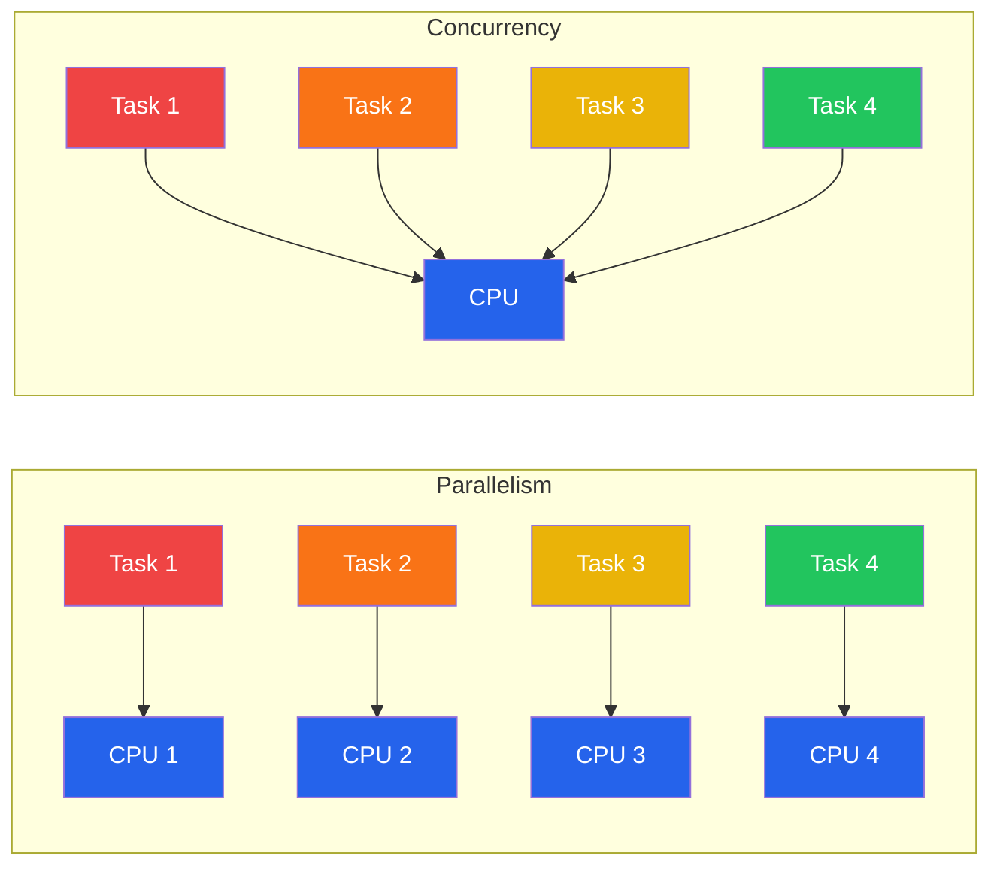
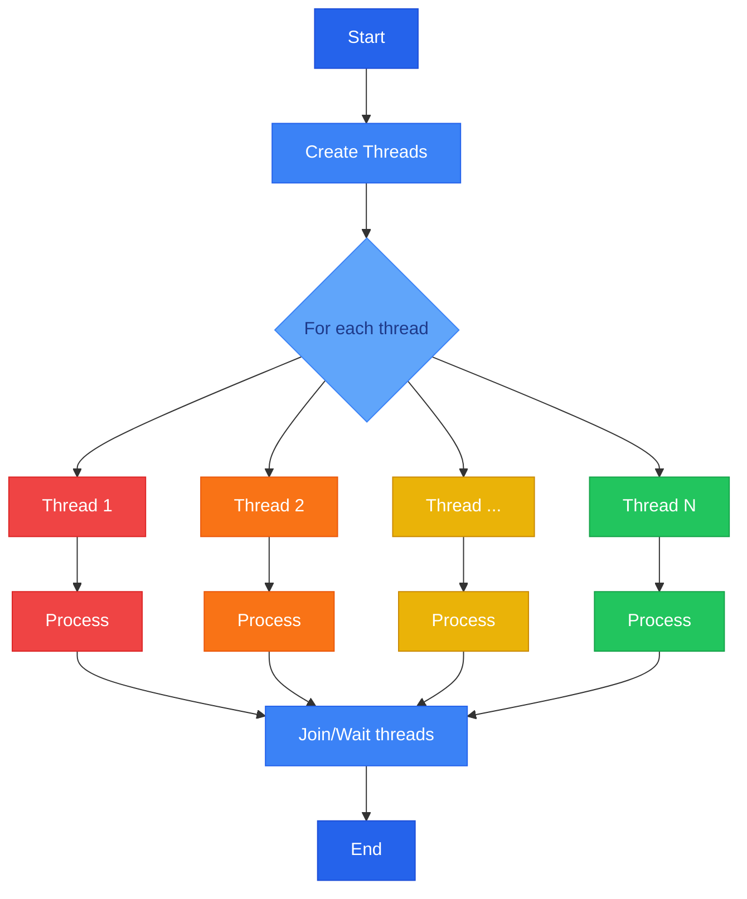
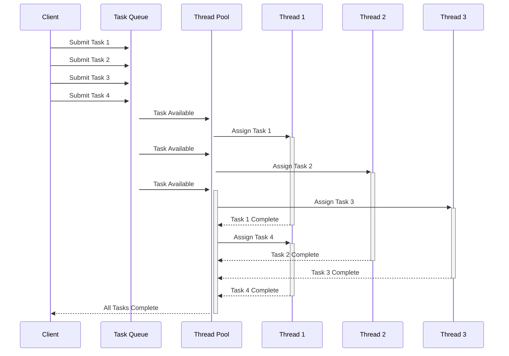

# Python Adventure

## 🔄 Concurrent Programming

Lập trình đồng thời (Concurrent Programming) là khả năng của một chương trình thực hiện nhiều tác vụ song song với nhau. Trong môi trường đa nhiệm hiện đại, lập trình đồng thời giúp tận dụng tối đa tài nguyên phần cứng và cải thiện hiệu suất của ứng dụng.

Có hai cách tiếp cận chính trong lập trình đồng thời:

1. **Parallelism (Song song)**: Thực sự chạy nhiều tác vụ cùng một lúc trên các CPU khác nhau.
2. **Concurrency (Đồng thời)**: Quản lý nhiều tác vụ cùng lúc, nhưng không nhất thiết phải chạy đồng thời về mặt vật lý.



### 🛠️ Cơ chế lập trình đồng thời trong Python

Trong Python, có một số cơ chế để thực hiện lập trình đồng thời:

- **Threading**: Sử dụng nhiều luồng trong cùng một process
- **Multiprocessing**: Sử dụng nhiều process độc lập
- **Asynchronous I/O**: Sử dụng coroutines và event loop
- **Thread Pool/Process Pool**: Quản lý và tái sử dụng một nhóm worker threads/processes

**📊 Phân loại và ứng dụng**

Mỗi cơ chế có ưu nhược điểm riêng và phù hợp với các loại tác vụ khác nhau:

| Cơ chế | Phù hợp với |
|--------|-------------|
| Threading | I/O-bound tasks |
| Multiprocessing | CPU-bound tasks |
| Async I/O | Network I/O và high-concurrency |

### 🔄 Process và Thread

Process (Tiến trình) và Thread (Luồng) là hai khái niệm cơ bản trong lập trình đồng thời. Process là một chương trình đang chạy trên hệ điều hành, nó có không gian bộ nhớ riêng biệt và độc lập. Mỗi process có thể chứa nhiều thread, và các thread trong cùng một process chia sẻ tài nguyên và không gian bộ nhớ với nhau.

> **Lưu ý**: Mỗi thread có vùng nhớ stack (ngăn xếp) và register (thanh ghi) riêng để lưu trữ các biến cục bộ và thông tin thực thi, trong khi tất cả các thread trong cùng một process đều chia sẻ vùng nhớ heap chung.


> **Quan trọng**: Trong Python, việc sử dụng thread bị giới hạn bởi Global Interpreter Lock (GIL), khiến cho tại một thời điểm chỉ có một thread có thể thực thi mã Python.

## 🧵 Threading

Python hỗ trợ đa luồng thông qua module `threading`. Threading phù hợp cho các tác vụ I/O-bound.

### Đặc điểm chính

- ✅ **Global Interpreter Lock (GIL)**: Python có GIL, một cơ chế khóa cho phép chỉ một luồng thực thi tại một thời điểm trong interpreter
- ✅ **Ưu điểm**: Dễ chia sẻ dữ liệu giữa các luồng, tiêu tốn ít tài nguyên
- ⚠️ **Nhược điểm**: Không tận dụng được nhiều CPU do GIL
- 🎯 **Ứng dụng**: Phù hợp cho các tác vụ I/O như đọc/ghi file, gọi API, truy cập database

### Ví dụ cơ bản

```python
import threading
import time

def worker():
    print(f"Thread {threading.current_thread().name} starting")
    time.sleep(2)
    print(f"Thread {threading.current_thread().name} finished")

threads = []
for i in range(3):
    t = threading.Thread(target=worker)
    threads.append(t)
    t.start()

for t in threads:
    t.join()
```

## 🔄 Threading IO

Thread được tạo (fork) thông qua `threading.Thread()` và khởi động bằng `start()`, cho phép chương trình chạy nhiều tác vụ đồng thời. Mỗi thread sẽ thực thi công việc của riêng nó một cách độc lập với các thread khác.



### Timeline hoạt động

```mermaid
gantt
    title Timeline of Main Thread and Child Threads
    dateFormat s
    axisFormat %S
    tickInterval 1second

    section Main Thread
    Initial State :milestone, m0, 0, 0s
    Create Threads :crit, done, a1, 0, 1s
    Wait for Threads :active, a2, after a1, 5s

    section Thread 1
    Process :active, t1, after a1, 4s

    section Thread 2
    Process :active, t2, after a1, 4s

    section Thread N
    Process :active, t3, after a1, 4s
```



## 👻 Daemon Thread

**Daemon thread** là một thread được chạy nền, nó sẽ tự động kết thúc khi main thread kết thúc. Daemon thread thường được sử dụng cho các tác vụ phụ trợ như logging, monitoring và cleanup tasks.

### Đặc điểm chính

- ✅ Tự động kết thúc khi main thread kết thúc
- ✅ Phù hợp cho các tác vụ background không quan trọng
- ⚠️ Không đảm bảo hoàn thành công việc trước khi kết thúc

> **Lưu ý**: Khác với non-daemon thread, daemon thread sẽ không ngăn chương trình kết thúc khi main thread hoàn tất công việc.

### Ví dụ

```python
import threading
import time

def infinite_task():
    while True:
        print("Daemon Thread is running...")
        time.sleep(1)

def main():
    daemon_thread = threading.Thread(target=infinite_task)
    daemon_thread.daemon = True
    daemon_thread.start()
    time.sleep(3)
    print("Main thread finished")

if __name__ == "__main__":
    main()
```


## 🔒 Synchronization using Lock 

**Lock** là một cơ chế đồng bộ hóa để tránh xung đột khi các thread truy cập và sửa đổi các biến chung.

### Đặc điểm chính

- 🔐 Khi một thread thực hiện `acquire()` lock, các thread khác phải đợi
- 🔓 Lock được `release()` trước khi thread khác có thể truy cập
- ✅ Đảm bảo tính *nhất quán của dữ liệu*
- ⚠️ Tránh được các vấn đề *race condition*

> **Lưu ý**: Với GIL, lock không thể đảm bảo tính nhất quán của dữ liệu trong các tác vụ CPU-bound.

### Ví dụ

```python
from threading import Lock
import threading

counter = 0
counter_lock = Lock()

def increment_counter():
    global counter
    counter_lock.acquire()
    print(f"Task is running {counter}...")
    for _ in range(100):
        counter += 1
    counter_lock.release()

if __name__ == "__main__":
    threads = []
    for i in range(5):
        thread = threading.Thread(target=increment_counter)
        threads.append(thread)
        thread.start()
    
    for thread in threads:
        thread.join()

    print(f"Counter: {counter}")
```


## 📬 Thread Queue 

Thread Queue là một cơ chế an toàn để trao đổi dữ liệu giữa các thread trong môi trường đa luồng, giúp đồng bộ hóa và điều phối công việc giữa producer và consumer threads.

**Đặc điểm chính**

- 🔄 Quản lý dữ liệu theo cơ chế FIFO (First In First Out)
- ✅ Thread-safe interface
- 🛡️ Tránh race condition
- 📥 `put()`: thêm item vào queue
- 📤 `get()`: lấy item ra khỏi queue
- ⏱️ Hỗ trợ blocking và timeout


**Ví dụ sử dụng thread queue**

```python
import queue
import threading
import time

def producer(q):
    for i in range(50):
        q.put(i)
        print(f"Produced {i}")
        time.sleep(0.1)
    print("Producer done")

def consumer(q):
    while True:
        try:
            item = q.get()
            print(f"Consumed {item}")
            time.sleep(0.2)
            q.task_done()
        except:
            break
    print("Consumer done")

def main():
    q = queue.Queue(maxsize=10)
    thread_producer = threading.Thread(target=producer, args=(q,))
    thread_consumer = threading.Thread(target=consumer, args=(q,), daemon=True)
    
    thread_producer.start()
    thread_consumer.start()
    
    # Wait for all tasks to be processed
    q.join()
    print("All tasks completed")

if __name__ == "__main__":
    main()
```


## 👥 Thread Pool

Thread Pool là một mô hình quản lý thread hiệu quả, trong đó một nhóm các worker thread được tạo sẵn để xử lý các tác vụ từ một hàng đợi công việc.

### Ưu điểm

- 🔄 **Tối ưu tài nguyên**: Giảm overhead của việc tạo và hủy thread liên tục
- 🎮 **Kiểm soát tốt hơn**: Giới hạn số lượng thread chạy đồng thời
- 📊 **Quản lý hiệu quả**: Tự động phân phối tác vụ cho các thread đang rảnh

### Ví dụ sử dụng ThreadPoolExecutor

```python
from concurrent.futures import ThreadPoolExecutor
import time

def worker(n):
    print(f"Processing {n}")
    time.sleep(2)
    return n * n

# Sử dụng with để tự động cleanup
with ThreadPoolExecutor(max_workers=3) as executor:
    # Map các tác vụ cho thread pool
    results = executor.map(worker, [1, 2, 3, 4, 5])
    # Kết quả được trả về theo thứ tự của input
    for result in results:
        print(f"Result: {result}")
```

**Sequence Diagram**



## 🚀 Multiprocessing

Module `multiprocessing` cho phép tận dụng nhiều CPU bằng cách tạo các tiến trình con.

### Đặc điểm

- ✅ **Ưu điểm**: Vượt qua giới hạn GIL, tận dụng được nhiều CPU
- ⚠️ **Nhược điểm**: Tốn nhiều tài nguyên hơn threading, khó chia sẻ dữ liệu
- 🎯 **Ứng dụng**: Phù hợp cho các tác vụ CPU-bound như xử lý hình ảnh, tính toán phức tạp

### Ví dụ

```python
from multiprocessing import Process, Pool

def heavy_calculation(n):
    return sum(i * i for i in range(n))

if __name__ == '__main__':
    # Sử dụng Pool để quản lý nhiều tiến trình
    with Pool(4) as p:
        result = p.map(heavy_calculation, [1000000, 2000000, 3000000])
```

## ⚡ Asyncio

`asyncio` là module cho phép lập trình bất đồng bộ với cú pháp async/await.

**Đặc điểm**

- ✅ **Ưu điểm**: Hiệu quả cho I/O-bound, dễ quản lý nhiều tác vụ đồng thời
- ⚠️ **Nhược điểm**: Yêu cầu thư viện hỗ trợ async, không phù hợp cho CPU-bound
- 🎯 **Ứng dụng**: Web servers, networking, real-time applications

**Ví dụ**

```python
import asyncio

async def fetch_data():
    print('start fetching')
    await asyncio.sleep(2)  # Giả lập I/O operation
    print('done fetching')
    return {'data': 1}

async def main():
    tasks = [fetch_data() for _ in range(3)]
    results = await asyncio.gather(*tasks)
    print(results)

asyncio.run(main())
```

**📊 So sánh và Lựa chọn**

| Cơ chế | Khi nào sử dụng |
|--------|-----------------|
| Threading | Cần xử lý nhiều tác vụ I/O và cần chia sẻ dữ liệu |
| Multiprocessing | Cần tận dụng nhiều CPU cho tính toán nặng |
| Asyncio | Cần xử lý nhiều I/O đồng thời với hiệu suất cao |

**📝 Best Practices**

1. ✅ Sử dụng threading cho I/O-bound tasks
2. ✅ Sử dụng multiprocessing cho CPU-bound tasks
3. ✅ Sử dụng asyncio cho modern async applications
4. ⚠️ Tránh over-engineering: đôi khi giải pháp tuần tự đơn giản là đủ
5. 🔒 Cẩn thận với race conditions và deadlocks khi sử dụng threading

## 📚 Materials

* [Python Threading Tutorial: Basic to Advanced (Multithreading, Pool Executors, Daemon, Lock, Events)](https://www.youtube.com/watch?v=Rm9Pic2rpAQ&t=353s&ab_channel=KevinWood%7CRobotics%26AI)
* [Multithreading for Beginners](https://www.youtube.com/watch?v=gvQGKRlgop4&t=2284s&ab_channel=freeCodeCamp.org)
* [SuperFastPython](https://superfastpython.com/)