# Python Adventure

## Concurrent

Process (Tiến trình) và Thread (Luồng) là hai khái niệm cơ bản trong lập trình đồng thời. Process là một chương trình đang chạy trên hệ điều hành, nó có không gian bộ nhớ riêng biệt và độc lập. Mỗi process có thể chứa nhiều thread, và các thread trong cùng một process chia sẻ tài nguyên và không gian bộ nhớ với nhau.

Mỗi thread có vùng nhớ stack (ngăn xếp) và register (thanh ghi) riêng để lưu trữ các biến cục bộ và thông tin thực thi, trong khi tất cả các thread trong cùng một process đều chia sẻ vùng nhớ heap chung. Điều này cho phép các thread có thể dễ dàng trao đổi dữ liệu với nhau, nhưng cũng đồng thời đòi hỏi cơ chế đồng bộ hóa phù hợp để tránh xung đột khi truy cập dữ liệu đồng thời.


Trong Python, việc sử dụng thread bị giới hạn bởi Global Interpreter Lock (GIL), khiến cho tại một thời điểm chỉ có một thread có thể thực thi mã Python. Vì vậy, thread trong Python thường được sử dụng cho các tác vụ I/O-bound (như đọc/ghi file, gọi API), trong khi process thường được dùng cho các tác vụ CPU-bound (như tính toán phức tạp) để tận dụng được sức mạnh của nhiều CPU.

Python cung cấp một số cách để thực hiện lập trình đồng thời (concurrent programming):

## Threading

Python hỗ trợ đa luồng thông qua module `threading`. Threading phù hợp cho các tác vụ I/O-bound:

- **Global Interpreter Lock (GIL)**: Python có GIL, một cơ chế khóa cho phép chỉ một luồng thực thi tại một thời điểm trong interpreter. Điều này ảnh hưởng đến hiệu suất của các tác vụ CPU-bound.
- **Ưu điểm**: Dễ chia sẻ dữ liệu giữa các luồng, tiêu tốn ít tài nguyên.
- **Nhược điểm**: Không tận dụng được nhiều CPU do GIL.
- **Ứng dụng**: Phù hợp cho các tác vụ I/O như đọc/ghi file, gọi API, truy cập database.

Ví dụ cơ bản về threading:

```python
import threading
import time

def worker():
    print(f"Thread {threading.current_thread().name} starting")
    time.sleep(2)
    print(f"Thread {threading.current_thread().name} finished")

threads = []
for i in range(3):
    t = threading.Thread(target=worker)
    threads.append(t)
    t.start()

for t in threads:
    t.join()
```

## Threading IO

Thread được tạo (fork) thông qua `threading.Thread()` và khởi động bằng `start()`, cho phép chương trình chạy nhiều tác vụ đồng thời. Mỗi thread sẽ thực thi công việc của riêng nó một cách độc lập với các thread khác. Sau khi tạo và khởi động các thread, chương trình sử dụng `join()` để đợi tất cả các thread hoàn thành trước khi tiếp tục thực thi.


Hoạt động của main thread và các thread con được mô tả trong sơ đồ

```mermaid
gantt
    title Timeline of Main Thread and Child Threads
    dateFormat s
    axisFormat %S

    section Main Thread
    Create Threads :crit, a1, 0, 1s
    Wait for Threads :done, a2, after a1, 6s

    section Thread 1
    Process :t1, after a1, 4s

    section Thread 2
    Process :t2, after a1, 4s

    section Thread 3
    Process :t3, after a1, 4s

    %%{init: { 
        'theme': 'base',
        'themeVariables': {
            'critBorderColor': '#2563eb',
            'critBkgColor': '#3b82f6',
            'doneColor': '#3b82f6',
            'doneBorderColor': '#2563eb',
            'lineWidth': '1px'
        }
    }}%%
```



## Multiprocessing

Module `multiprocessing` cho phép tận dụng nhiều CPU bằng cách tạo các tiến trình con:

- **Ưu điểm**: Vượt qua giới hạn GIL, tận dụng được nhiều CPU.
- **Nhược điểm**: Tốn nhiều tài nguyên hơn threading, khó chia sẻ dữ liệu giữa các tiến trình.
- **Ứng dụng**: Phù hợp cho các tác vụ CPU-bound như xử lý hình ảnh, tính toán phức tạp.

Ví dụ về multiprocessing:
```python
from multiprocessing import Process, Pool

def heavy_calculation(n):
    return sum(i * i for i in range(n))

if __name__ == '__main__':
    # Sử dụng Pool để quản lý nhiều tiến trình
    with Pool(4) as p:
        result = p.map(heavy_calculation, [1000000, 2000000, 3000000])
```

## Asyncio

`asyncio` là module cho phép lập trình bất đồng bộ với cú pháp async/await:

- **Ưu điểm**: Hiệu quả cho I/O-bound, dễ quản lý nhiều tác vụ đồng thời.
- **Nhược điểm**: Yêu cầu thư viện hỗ trợ async, không phù hợp cho CPU-bound.
- **Ứng dụng**: Web servers, networking, real-time applications.

Ví dụ về asyncio:
```python
import asyncio

async def fetch_data():
    print('start fetching')
    await asyncio.sleep(2)  # Giả lập I/O operation
    print('done fetching')
    return {'data': 1}

async def main():
    tasks = [fetch_data() for _ in range(3)]
    results = await asyncio.gather(*tasks)
    print(results)

asyncio.run(main())
```

## So sánh và Lựa chọn

1. **Threading**: Chọn khi cần xử lý nhiều tác vụ I/O và cần chia sẻ dữ liệu.
2. **Multiprocessing**: Chọn khi cần tận dụng nhiều CPU cho tính toán nặng.
3. **Asyncio**: Chọn khi cần xử lý nhiều I/O đồng thời với hiệu suất cao.

## Best Practices

1. Sử dụng threading cho I/O-bound tasks
2. Sử dụng multiprocessing cho CPU-bound tasks
3. Sử dụng asyncio cho modern async applications
4. Tránh over-engineering: đôi khi giải pháp tuần tự đơn giản là đủ
5. Cẩn thận với race conditions và deadlocks khi sử dụng threading