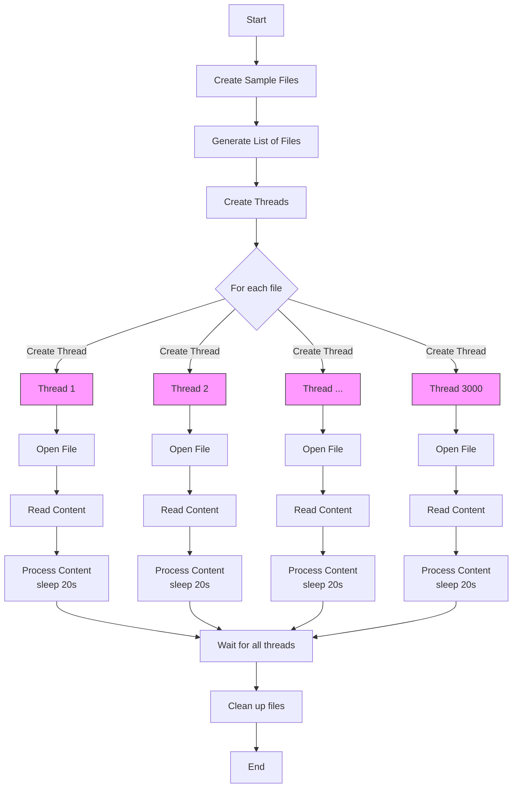

```mermaid
graph TD
    A[Start] --> B[Create Sample Files]
    B --> C[Generate List of Files]
    C --> D[Create Threads]
    D --> E{For each file}
    E -->|Create Thread| F[Thread 1]
    E -->|Create Thread| G[Thread 2]
    E -->|Create Thread| H[Thread ...]
    E -->|Create Thread| I[Thread 3000]
    
    F --> J1[Open File]
    G --> J2[Open File]
    H --> J3[Open File]
    I --> J4[Open File]
    
    J1 --> K1[Read Content]
    J2 --> K2[Read Content]
    J3 --> K3[Read Content]
    J4 --> K4[Read Content]
    
    K1 --> L1[Process Content<br>sleep 20s]
    K2 --> L2[Process Content<br>sleep 20s]
    K3 --> L3[Process Content<br>sleep 20s]
    K4 --> L4[Process Content<br>sleep 20s]
    
    L1 --> M[Wait for all threads]
    L2 --> M
    L3 --> M
    L4 --> M
    
    M --> N[Clean up files]
    N --> O[End]

    style F fill:#f9f,stroke:#333
    style G fill:#f9f,stroke:#333
    style H fill:#f9f,stroke:#333
    style I fill:#f9f,stroke:#333
``` 